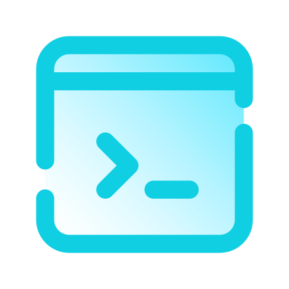
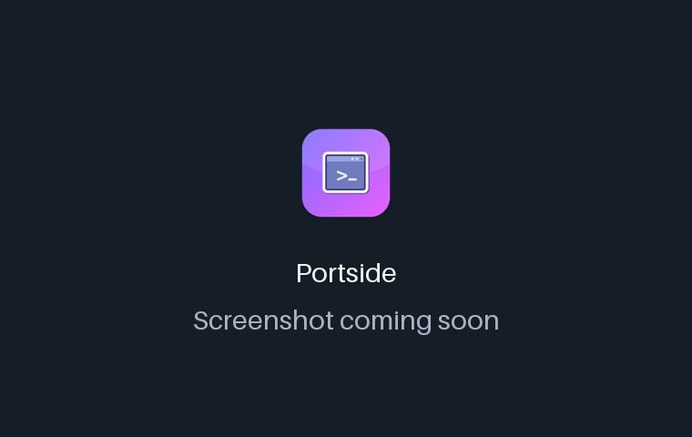
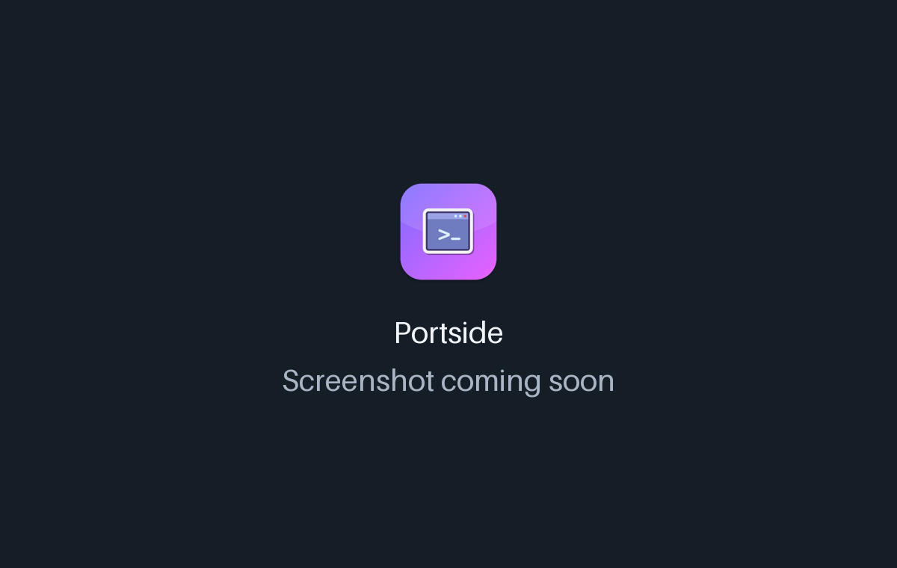

<!-- From jejezz/application-release-templates common/tool/readme @ conventions-v1.
     tool/readme/init_readme.py가 만든 파일입니다 — conventions/readme-guide.md 참고.
     {{TODO: …}}를 모두 채우십시오. 하나라도 남아 있으면 tool/readme/check_readme.py가 실패합니다. -->

<p align="center">
  
</p>

<h1 align="center">Portside</h1>

<p align="center">
  macOS·Windows·Linux에서 쓰는 무료 오픈소스 <b>USB-to-Serial(COM) 시리얼 터미널</b> — 여러 보드를 탭으로 동시에 연결하고, 미리 써 둔 명령을 한 줄씩 보내고, Hex로 보고 기록합니다. 최신 OS에서도 도는 <b>CoolTerm 대안</b>입니다.
</p>

<p align="center">
  <a href="https://github.com/jejezz/portside-flutter/releases/latest"></a>
  <a href="https://github.com/jejezz/portside-flutter/releases"></a>
  
  
  <a href="LICENSE"></a>
</p>

<p align="center">
  <a href="README.md">English</a> · <b>한국어</b>
</p>

<p align="center">
  
</p>

## 기능

- **탭 세션** — 포트마다 탭을 열어 여러 보드와 동시에 통신합니다. 뒤에 있는 탭도 계속 받고 기록합니다
- **핫플러그 포트 목록** — 2초마다 포트를 다시 찾습니다. 보드레이트는 자유 입력이고 1200~230400 프리셋이 있습니다
- **진짜 터미널** — ANSI 256색·트루컬러, 화살표·Ctrl 조합 입력, 스크롤백 최대 10만 줄 ([xterm2](https://pub.dev/packages/xterm2))
- **Line Sender** — 명령을 여러 줄 써 두고 Enter를 누르면 커서 줄을 보내고 다음 줄로 넘어갑니다. 줄 끝(없음 / `\n` / `\r` / `\r\n`)과 로컬 에코를 고를 수 있습니다
- **Hex View와 기록** — 받은 바이트를 그대로 hex dump로 보고, 탭마다 원본 바이트를 원하는 파일에 기록합니다
- **터미널 색상 테마** — Solarized, Dracula, Nord, Gruvbox, 그린 포스포 등. 폰트와 크기도 기억합니다
- **라이트·다크, 한국어·English** — 시스템 설정을 따르거나 툴바에서 고를 수 있습니다

<p align="center">
  
  
</p>

## 설치

[**Releases**](https://github.com/jejezz/portside-flutter/releases/latest)에서 받습니다.

| OS | 파일 |
|---|---|
| macOS 12.0 이상 | `Portside-<버전>-macos-universal.dmg` — 열어서 앱을 Applications 폴더로 끌어다 놓으세요 |
| Windows 10/11 (x64) | `Portside-<버전>-windows-x64-setup.exe` |
| Linux (x64) | `Portside-<버전>-linux-x64.tar.gz` — 압축을 풀고 `./install.sh` 실행 (`--remove`로 제거) |

**Windows:** 설치 프로그램에 아직 코드 서명이 없어서 SmartScreen이 "Windows의 PC 보호" 창을 띄웁니다. **추가 정보 → 실행**을 누르세요.

## 동작 방식

시리얼 입출력은 `flutter_libserialport`를 거쳐 [libserialport](https://sigrok.org/wiki/Libserialport)가 맡고, 터미널 화면과 키 입력·이스케이프 시퀀스 처리는 `xterm2`가 맡습니다. 받은 바이트는 따로 원본 버퍼에도 쌓기 때문에, Hex View와 기록 파일에는 터미널이 해석한 결과가 아니라 기기가 실제로 보낸 바이트가 그대로 남습니다.

### 단축키

| 동작 | macOS | Windows / Linux |
|---|---|---|
| 새 탭 | ⌘T | Ctrl+Shift+T |
| 탭 닫기 | ⌘W | Ctrl+Shift+W |
| 기록 시작/정지 | ⌘⇧R | Ctrl+Shift+R |
| 화면 지우기 | ⌘K | Ctrl+Shift+K |

Windows와 Linux에서 Shift를 함께 쓰는 이유는 그냥 Ctrl+W/K/T가 기기 쪽 셸에서 쓰는 제어 문자이기 때문입니다.

### 알려진 한계

- macOS에서 터미널 화면에 한글을 직접 입력하면 조합이 깨집니다 (`xterm2` / `xterm.dart`의 텍스트 입력 버그). Line Sender 입력칸은 일반 텍스트 필드라 영향이 없습니다.

## 개발

```bash
flutter pub get
flutter run -d macos
```

빌드에 필요한 것:

- **macOS**: Xcode 전체 설치(Command Line Tools만으로는 안 됨), Homebrew `autoconf automake libtool pkg-config` — `flutter_libserialport`가 CocoaPods로 libserialport를 소스 빌드합니다
- **Windows**: Visual Studio("C++를 사용한 데스크톱 개발" 워크로드)
- **Linux**: `clang cmake ninja-build pkg-config libgtk-3-dev liblzma-dev`

설계 배경과 기록: [DESIGN.md](DESIGN.md). Windows 설치 프로그램을 로컬에서 만들기: [docs/windows-installer.md](docs/windows-installer.md).

릴리스: `scripts/bump-version.sh patch` → 병합 → `vX.Y.Z` 태그. CI가 모든 플랫폼을 빌드해서 올립니다. 규칙: [application-release-templates/conventions](https://github.com/jejezz/application-release-templates/tree/main/conventions).

## 크레딧

- 글꼴: [서울남산체](https://www.seoul.go.kr/seoul/font.do) (서울특별시)
- 앱 아이콘 글리프: [Icons8](https://icons8.com)
- 시리얼 포트 접근: [libserialport](https://sigrok.org/wiki/Libserialport) (LGPL-3.0, 동적 링크)

## 라이선스

[MIT](LICENSE) © 2026 Jongyun Ahn
